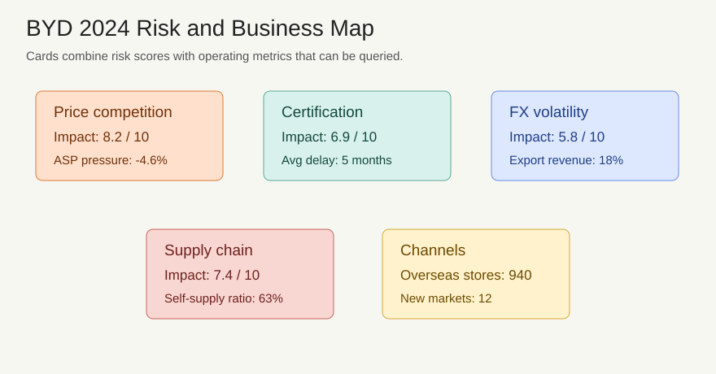

# 比亚迪 2024 年年度报告样例

## 管理层讨论与分析

比亚迪 2024 年研发重点集中在刀片电池、混动系统、智能驾驶平台和整车电子架构。公司通过垂直整合提升核心零部件自研比例，以增强成本控制和车型迭代速度。

新能源汽车销量增长带动营业收入提升，高端品牌和乘用车出口贡献增量。公司继续扩展欧洲和东南亚销售网络，并提升售后服务覆盖率。

## 财务报表

| 指标 | 2023 | 2024 | 同比变化 | 主要原因 |
| --- | ---: | ---: | ---: | --- |
| 新能源汽车销量 | 302 万辆 | 427 万辆 | +41.4% | 新车型上市、海外渠道扩张 |
| 海外销量 | 24 万辆 | 42 万辆 | +75.0% | 欧洲和东南亚渠道扩张 |
| 营业收入 | 6023 亿元 | 7298 亿元 | +21.2% | 新能源汽车销量增长、高端品牌贡献增量 |
| 经营活动现金流 | 1697 亿元 | 1845 亿元 | +8.7% | 整车销量增长、供应链议价能力增强 |
| 存货周转天数 | 72 天 | 61 天 | -11 天 | 订单预测和生产排程优化 |

公司现金等价物余额保持充足，经营活动现金流达到 1845 亿元，覆盖研发投入、渠道建设和产能升级。管理层强调将继续控制低效项目支出，并把存货周转天数从 72 天压降到 61 天。

## 风险因素

公司面临新能源汽车价格竞争、海外认证周期、汇率波动和供应链扰动风险。风险图显示价格竞争影响评分为 8.2/10，海外认证周期评分为 6.9/10，供应链扰动评分为 7.4/10。管理层通过规模化制造、核心零部件自供和区域化运营对冲行业降价压力。
