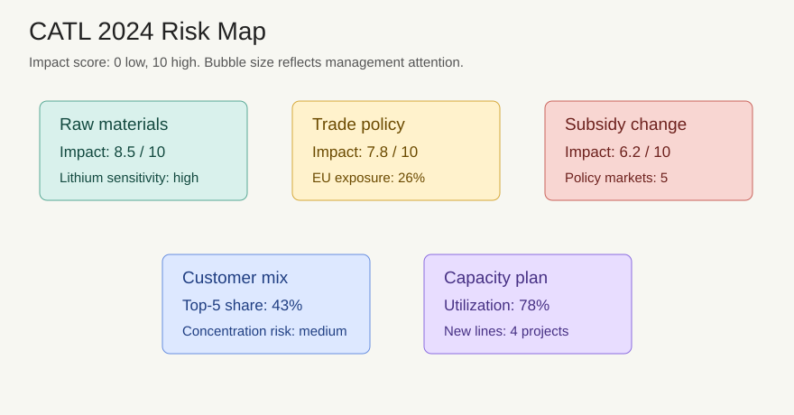

# 宁德时代 2024 年年度报告样例

## 管理层讨论与分析

宁德时代 2024 年继续围绕动力电池、储能系统和钠离子电池加大研发投入。公司在快充、安全性和能量密度方面推进多条技术路线，并通过材料体系优化降低单位制造成本。

公司海外客户需求保持增长，欧洲和东南亚储能项目交付节奏改善。管理层认为全球新能源装机需求仍有韧性，但原材料价格和贸易政策变化会影响短期盈利弹性。

## 财务报表

| 指标 | 2023 | 2024 | 同比变化 | 主要原因 |
| --- | ---: | ---: | ---: | --- |
| 营业收入 | 4009 亿元 | 4268 亿元 | +6.5% | 储能业务放量、海外订单增加 |
| 储能系统收入 | 599 亿元 | 735 亿元 | +22.7% | 大型储能项目交付增加 |
| 毛利率 | 22.9% | 24.4% | +1.5pct | 碳酸锂价格回落、产品结构优化 |
| 经营活动现金流 | 928 亿元 | 1036 亿元 | +11.6% | 客户回款改善、资本开支节奏控制 |
| 研发投入 | 184 亿元 | 211 亿元 | +14.7% | 快充、安全性和钠离子电池研发增加 |

经营活动现金流保持净流入，2024 年达到 1036 亿元，主要来自客户回款改善和库存周转效率提升。公司继续控制资本开支节奏，同时保障关键产线扩建和 211 亿元研发投入。

## 风险因素

公司面临原材料价格波动、海外贸易壁垒、新能源补贴政策变化和客户集中度提升等风险。风险图显示原材料价格敏感度最高，影响评分为 8.5/10；海外贸易政策影响评分为 7.8/10。管理层计划通过长期采购协议、全球产能布局和客户结构优化降低波动。
